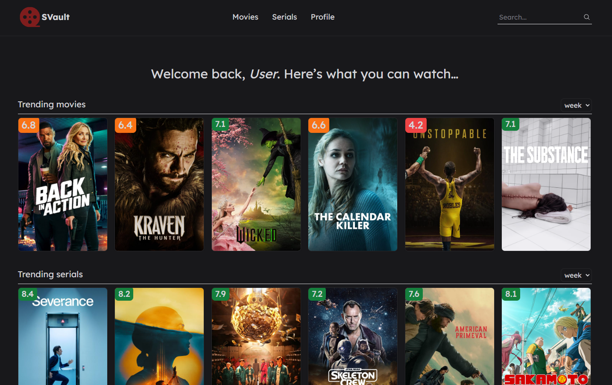
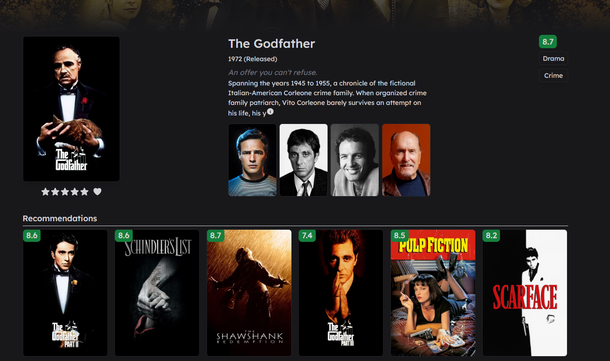

# React & Typescript movie app




## Live Demo

[SVault](movie-app-delta-beryl.vercel.app)

## Features

#### Discover

- `Search and Browse` - Easily search for _Movies_ and _Serials_
- `Detailed Information` - Get detailed information about _Movies_ and _Serials_, including cast, ratings, release dates, trailers, etc.

#### Evaluation

- `Favorite` - Save your favorite _Movies_ and _Serials_ to your personal collection for quick access.

- `Ratings`: Rate _Movies_ and _Serials_.

## Technologies, libraries and tools used:

- `React`
- `React Query`
- `Typescript`
- `Tailwind Css`
- `Redux`
- `Axios`

## Getting Started
#### Install needed dependencies from the root directory:


```
  npm i
```

#### Create a `.env.local` file in the root directory and set the following environment variables:

VITE_API_TOKEN = Get token on [TMDB](https://www.themoviedb.org/settings/api)

#### In order to run the project locally, run the following command from the root directory
```
  npm run dev
```
